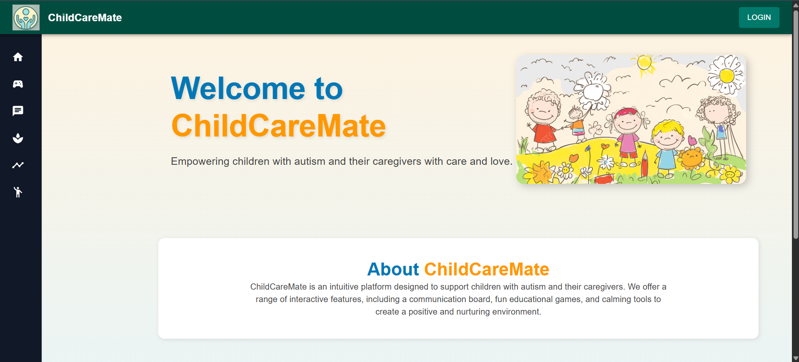
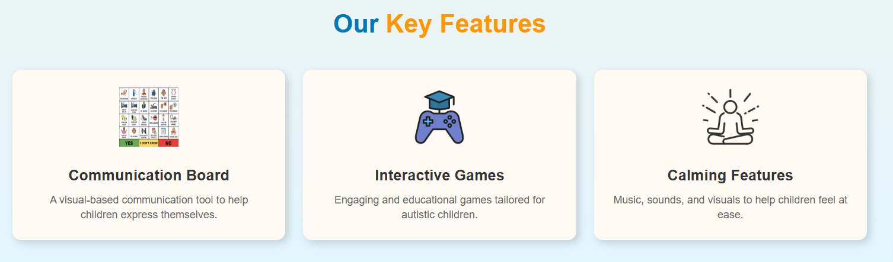

# 👶 ChildCareMate

ChildCareMate is a full-stack web application designed to support parents and caregivers of children, especially those with special needs. The app combines learning, health tracking, communication support, and professional resources in one centralized platform.



---

## 🌟 Key Features

- 🎮 **Gamified Learning** – Fun, interactive and engaging tools to aid cognitive development.
- 💬 **Communication Board** – Visual communication tools for children with speech or language delays.
- 📈 **Milestone Tracker** – Tracks developmental milestones based on age and medical conditions.
- 📍 **Therapist Locator** – Helps find nearby therapists.

---

## 📸 Screenshots

 


---

## 🚀 Getting Started

### 1. Clone the repository

```bash
step 1.
git clone https://github.com/Dhanshree37/ChildCareMate.git
cd ChildCareMate

2. Install dependencies

cd backend
npm install

cd ../frontend
npm install

3. Setup environment variables
Create a .env file inside the backend/ directory:

DB_HOST=localhost
DB_USER=root
DB_PASSWORD=yourPassword
DB_NAME=autism_app
JWT_SECRET=yourSuperSecretKey

4. Run the application
Use a split terminal or open two terminals:

Backend
cd backend
npm start

Frontend
cd frontend
npm start

Then open your browser at:
👉 http://localhost:3000

```
### 🛠 Tech Stack

**Frontend:**
- React.js  
- Material UI  
- JavaScript, HTML, CSS  

**Backend:**
- Node.js & Express.js  
- MySQL  
- JWT for Auth  
- bcrypt for password hashing  


### ⚠️ Disclaimer  
This project uses various images and audio clips that may not be under an open license. They are used for educational/demo purposes only.  
If you own any content and wish it to be removed, feel free to raise an issue or contact the maintainer.

---

### 📬 Contact  
✉️ dhanshreepatil51@gmail.com  

---

### 📄 License  
This project is open-source under the **MIT License**.  
Feel free to use, modify, and distribute.
